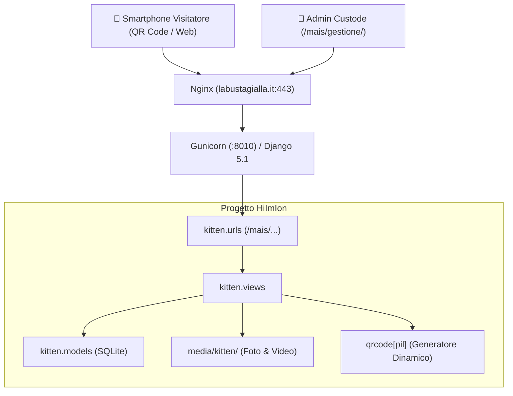

# 🐾 Adozione Mais — Progetto, Componenti e Contesto

Documentazione completa dell'applicazione web e del materiale promozionale per l'adozione di **Mais**, cucciola di gatto di circa 7 settimane, integrata all'interno della piattaforma **[labustagialla.it](https://labustagialla.it)** (`HiImIon`).

---

## 1. Contesto e Obiettivi del Progetto

### Il Caso di Mais
* **Nome:** Mais (da *micetto* ➔ *mice* [topo] ➔ pronunciato all'italiana: *Mais* 🌽).
* **Profilo:** Femmina, ~7 settimane di vita, completamente nera corvino (piccola panterina).
* **Carattere & Abitudini:** Molto giocherellona, vispa, affettuosa, mangia pappa umida con appetito e usa regolarmente la lettiera.
* **Stato Sanitario:** Prima visita veterinaria e prima sverminazione completate con successo. Da completare: vaccini, seconda sverminazione e futura sterilizzazione (in età opportuna).
* **Localizzazione:** Pescara (zona Aeroporto) e zone limitrofe.

### Obiettivo
Realizzare una soluzione a doppio canale ad altissima conversione per trovare alla gattina una famiglia per sempre:
1. **Canale Digitale (Web):** Una pagina web pubblica calorosa ed emozionante in stile **Feed / Blog** su `labustagialla.it/mais/`, ottimizzata per smartphone, con storie quotidiane, player video integrato, foto ad alta definizione, lightbox a tutto schermo, contatore interattivo di fusa/cuori e pulsante diretto WhatsApp pre-compilato.
2. **Canale Fisico (Stampa):** Due formati di volantini stampabili (Locandina A4 con tagliandini a strappo e Flyer A5 compatto) dotati di **QR Code dinamico** che riporta direttamente alla pagina web, ideali per cliniche veterinarie, negozi per animali, bacheche e negozi di quartiere.
3. **Pannello di Controllo per il Custode:** Interfaccia mobile-friendly protetta da autenticazione per consentire al proprietario di inserire il proprio recapito telefonico, aggiornare lo stato di adozione e caricare foto/video al volo direttamente dallo smartphone.

---

## 2. Architettura & Topologia

L'applicazione fa parte del progetto Django `HiImIon` che governa la radice di `labustagialla.it` sulla porta Gunicorn `:8010`, protetto da Nginx con terminazione SSL.



### Mappa degli URL
| Percorso | Vista / Handler | Descrizione |
|---|---|---|
| `/mais/` | `kitten_detail` | **Landing pubblica & Feed/Blog:** Presentazione, scheda salute, video, foto, pulsante WhatsApp e cuori interattivi. |
| `/adotta/` | `kitten_redirect` | Reindirizzamento permanente verso `/mais/`. |
| `/gattino/` | `kitten_redirect` | Reindirizzamento permanente verso `/mais/`. |
| `/mais/like/` | `kitten_like` | Endpoint POST AJAX con protezione CSRF per registrare le fusa (like profilo o like singolo post). |
| `/mais/qr/` | `kitten_qr` | Genera dinamicamente l'immagine PNG ad alta risoluzione del QR code puntato a `https://labustagialla.it/mais/`. |
| `/mais/volantino/a4/` | `kitten_flyer_a4` | **Locandina A4 stampabile** con foto, specifiche, grande QR code e 8 tagliandini verticali a strappo con telefono e mini QR. |
| `/mais/volantino/a5/` | `kitten_flyer_a5` | **Flyer A5 compatto** formato cartolina per bacheche e negozi. |
| `/mais/gestione/` | `kitten_admin` | **Pannello di controllo custode:** Configurazione contatti (telefono/WhatsApp), upload rapido media e gestione post. |
| `/mais/post/<id>/delete/` | `kitten_delete_post` | Eliminazione sicura di un post dal feed (riservato allo staff). |
| `/media/<path>` | `django.views.static.serve` | Servizio dei file multimediali caricati (immagini e video). |

---

## 3. Moduli e Componenti Dettagliati

### 3.1 Modelli Dati (`kitten/models.py`)

#### 1. `KittenProfile`
Rappresenta l'identità e lo stato di adozione del gattino:
* `name` (default: `'Mais'`): Nome visualizzato.
* `slug` (default: `'mais'`): Identificatore URL.
* `tagline`: Sottotitolo descrittivo (*"Femmina · 7 settimane · Piccola panterina nera"*).
* `gender`, `age_text`, `color`, `location`: Scheda anagrafica.
* `phone_number` & `whatsapp_number`: Recapiti telefonici inseriti dall'utente dall'admin.
* `clean_whatsapp_number` (property): Rimuove caratteri non numerici e antepone il prefisso internazionale `39` per i numeri italiani.
* `whatsapp_url` (property): Genera il deep link `https://wa.me/...` con messaggio d'adozione precompilato.
* `bio_intro`, `personality`, `health_info`, `adoption_requirements`: Testi informativi ed emozionali.
* `cover_image`: Immagine di copertina personalizzata (fallback automatico su `/static/img/mais_placeholder.jpg`).
* `is_adopted`: Booleano per attivare il banner di adozione completata (`adopted_banner_text`).
* `likes_count`: Contatore totale di fusa ricevute.

**Tutte le sezioni e descrizioni del sito sono 100% modificabili da pannello:**
1. **Intestazione & Hero:** Titolo (`hero_title`), slogan (`tagline`), badge di stato e luogo (`hero_badge`, `hero_location_badge`), i 4 riquadri specifiche (`spec_gender`, `spec_age`, `spec_color`, `spec_location`), foto di copertina (`cover_image`).
2. **Storia & Presentazione:** Titolo (`story_title`), icona (`story_icon`), testo biografia completa (`bio_intro`), citazione in evidenza dorata (`story_quote`).
3. **Carattere & Superpoteri:** Titolo (`personality_title`), descrizione (`personality`), e i 4 punti elenco (`bullet_1`, `bullet_2`, `bullet_3`, `bullet_4`).
4. **Stato Sanitario & 4 Tappe:** Titolo (`health_title`), sottotitolo (`health_subtitle`), e per ciascuna delle 4 tappe: titolo, descrizione, badge personalizzato e spunta completata (`health_step1_...` fino a `health_step4_...`).
5. **Diario & Feed:** Titolo (`feed_title`), sottotitolo (`feed_subtitle`), titolo e descrizione per stato vuoto (`feed_empty_title`, `feed_empty_desc`).
6. **Requisiti Adozione & Call To Action:** Titolo (`adoption_title`), badge (`adoption_badge`), introduzione (`adoption_intro`), requisiti dettagliati (`adoption_requirements`), box finale d'invito (`adoption_cta_title`, `adoption_cta_desc`), e messaggio WhatsApp pre-compilato (`whatsapp_message`).
7. **Volantini Stampabili A4 & A5:** Badge superiore (`flyer_header_badge`), titolo principale (`flyer_title`), sottotitolo (`flyer_subtitle`), testo box QR (`flyer_cta_text`, `flyer_cta_sub`), etichetta contatto (`flyer_contact_label`).

#### 2. `KittenPost`
Rappresenta i singoli aggiornamenti del diario/feed:
* `kitten`: Relazione ForeignKey con `KittenProfile`.
* `title`: Titolo o momento dell'evento.
* `caption`: Testo descrittivo del momento.
* `tag`: Categoria colorata (*Attacco Giocherellone 🎾*, *Momento Pappa 🐟*, *Fusa e Coccole 💖*, *Pisolo Strategico 💤*, *Piccole Scoperte 🐾*, *Visita Veterinaria 🩺*).
* `media_type`: `'photo'`, `'video'`, o `'text'`.
* `image`: Immagine caricata (`kitten/posts/images/`).
* `video`: File video caricato (`kitten/posts/videos/`).
* `likes`: Conteggio like per il singolo post.
* `created_at`: Data e ora di pubblicazione.

---

### 3.2 Viste e Logica di Business (`kitten/views.py`)
* **`kitten_detail`**: Recupera profilo e post ordinati cronologicamente in senso decrescente (`-created_at`). Rileva se la richiesta proviene da un utente staff autenticato per mostrare tasti rapidi di editing.
* **`kitten_like`**: Gestione asincrona dei click sul pulsante "Fai le fusa" o sui cuori dei singoli post, con risposta JSON immediata.
* **`kitten_qr`**: Utilizza la libreria Python `qrcode[pil]` per generare al volo un'immagine PNG nitida con matrice quadrata, correzione d'errore livello M e contrasto ottimizzato per la stampa.
* **`kitten_flyer_a4` & `kitten_flyer_a5`**: Renderizzano i template di stampa passando il profilo di Mais e il link ufficiale.
* **`kitten_admin`**: Vista protetta da decoratore `@_staff_required`. Gestisce le form `KittenProfileForm` e `KittenPostForm` con supporto multipart per file pesanti.

---

### 3.3 Frontend e Template (`templates/kitten/`)

1. **`templates/kitten/detail.html`:**
   * **Design Mobile-First:** Palette calorosa dark-amber (sfondo `#121214`, accenti dorati `#f59e0b`, verde WhatsApp `#25D366`).
   * **Pulsante "Fai le fusa":** Micro-animazione CSS `heartPop` al click.
   * **Lightbox:** Visualizzatore modale a schermo intero per ingrandire le fotografie.
   * **Player Video HTML5:** Supporto per riproduzione inline e comandi nativi per video smartphone (`mp4`, `mov`, `webm`).
   * **Open Graph:** Tag social (`og:title`, `og:image`, `og:description`) per anteprime accattivanti su WhatsApp, Telegram e Facebook.

2. **`templates/kitten/admin.html`:**
   * Integrato con la dashboard `/panel/` di labustagialla.
   * Box in primo piano per inserire il numero di telefono.
   * Area di dropzone per selezionare foto o video direttamente dal rullino dello smartphone.
   * Lista dei post pubblicati con miniature e cancellazione istantanea.

3. **`templates/kitten/flyer_a4.html`:**
   * Dimensioni standard A4 (210mm × 297mm).
   * **8 tagliandini verticali a strappo** alla base della pagina: ciascuno include il nome di Mais, zona, numero di telefono e un mini QR code scansionabile anche dopo che il tagliandino è stato staccato.

4. **`templates/kitten/flyer_a5.html`:**
   * Dimensioni compatte A5 (148mm × 210mm).
   * Formato cartolina ad alto impatto per bacheche e banconi di negozi.

---

### 3.4 Fogli di Stile (`static/css/`)

1. **`static/css/kitten.css`:**
   * Reset moderno, variabili CSS, layout CSS Grid e Flexbox.
   * Glassmorphism e ombre morbide.
   * Responsive breakpoint a `768px` per garantire un'esperienza impeccabile su smartphone.

2. **`static/css/flyer.css`:**
   * Regole di stampa `@media print` dedicate:
     * `@page { size: A4/A5; margin: 0; }`
     * `-webkit-print-color-adjust: exact; print-color-adjust: exact;` per forzare la stampa a colori di bordi, badge e sfondi.
   * Barra superiore con pulsante "Stampa / Salva PDF" che scompare automaticamente sulla carta stampata (`.no-print`).

---

## 4. Configurazione & Deployment

### Dipendenze Aggiunte (`requirements.txt`)
* `Pillow>=10.0.0`: Elaborazione immagini e supporto `ImageField` in Django.
* `qrcode[pil]>=8.0`: Generazione vettoriale/raster di QR code.

### Limiti di Upload (`hiimion/settings.py`)
Per consentire il caricamento di video ad alta risoluzione direttamente da smartphone:
```python
DATA_UPLOAD_MAX_MEMORY_SIZE = 100 * 1024 * 1024  # 100MB
FILE_UPLOAD_MAX_MEMORY_SIZE = 100 * 1024 * 1024  # 100MB
```

### Configurazione Nginx (`deploy/nginx-labustagialla-merged.conf`)
Aggiunta la direttiva per evitare l'errore `413 Request Entity Too Large` durante il caricamento di video:
```nginx
server {
    server_name labustagialla.it www.labustagialla.it;
    limit_req_status 429;
    client_max_body_size 64M;
    ...
}
```

---

## 5. Guida Rapida Operativa per l'Utente

### Passo 1: Inserire il Numero di Telefono
1. Effettua il login su `https://labustagialla.it/panel/login/` (o in locale su `http://127.0.0.1:8000/panel/login/`).
2. Clicca sulla voce **"🐾 Mais"** nel menu in alto.
3. Nel box **"Numero di Telefono / WhatsApp"**, digita il tuo numero e premi **"💾 Salva Modifiche Profilo"**.
4. Da questo momento, sia la pagina web che i volantini mostreranno il tuo recapito e abiliteranno la chat WhatsApp con 1 click!

### Passo 2: Caricare Foto e Video dal Telefono
1. Apri dal browser dello smartphone `https://labustagialla.it/mais/gestione/`.
2. Nella sezione **"📸 Carica Nuova Foto o Video"**:
   * Seleziona la categoria (es. *Attacco Giocherellone* o *Momento Pappa*).
   * Tocca su **Foto** o **Video** e scegli il file dal rullino.
   * Scrivi due righe di didascalia.
   * Premi **"🚀 Pubblica nel Diario di Mais"**.

### Passo 3: Stampare i Volantini
1. Apri la locandina A4: `https://labustagialla.it/mais/volantino/a4/`.
2. Clicca sul pulsante **"🖨️ Stampa / Salva PDF"** (o premi `Ctrl + P` / `Cmd + P`).
3. Nelle opzioni di stampa del browser:
   * **Destinazione:** La tua stampante oppure *Salva come PDF*.
   * **Margini:** *Nessuno* (o *Predefiniti*).
   * **Opzioni:** Spunta **"Grafica in background"** (per stampare i colori esatti).
4. Taglia con le forbici le linee verticali tratteggiate alla base per creare i tagliandini staccabili!

---

## 6. Test e Verifica Qualità
La suite di test automatizzati include verifiche dedicate per tutti gli endpoint in `kitten/tests.py`:
* Caricamento pagina di dettaglio (`200 OK`) con presenza di nome, età e zona.
* Reindirizzamento corretto da `/adotta/` e `/gattino/` (`302 Found` ➔ `/mais/`).
* Generazione stream PNG per il QR code (`200 OK`, header `image/png`).
* Render delle locandine A4 e flyer A5 (`200 OK`).
* Incremento fusa/like via AJAX con risposta JSON.
* Restrizione dei permessi del pannello admin (accesso consentito solo a utenti `is_staff`).
* Aggiornamento del numero di telefono e normalizzazione del link WhatsApp.
